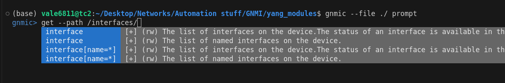

# gNMI Notes

**GNMI** is a protocol for network management on top of **gRPC**; as it uses GRPC is very efficient (via protcol buffers uses binary data)

- data model is YANG
- Capable of both configuration and telemetry
- it can stream data from devices in real time
- it is vendor agnostic
- it is supported by multiple languages (python/golang)

It provides unificiation of SNMP/CLI/SSH

### Protocol Buffers (Protobuffs)

This is a binary serialization protocol developed by Google and implemented by **gRPC**; It actually allows the payload to be transmitted as JSON, BYTES(binary) or PROTO (prototext similar to JSON).  
It is **strongly typed** and language agnostic (i.e. suported by multiple languages). By default it uses **TLS** with credentials or certificates and **TCP/6030 port** (used for Arista gNMI).  
The payload is optimized, e.g. you could squeeze a milion route routing table into a small payload.  
The file format used to define the message structure is usuall **.proto**


### gNMI Operations:
 - **Capabilities**: gNMI allows to exchange capabilities to see what each client supports in terms of operations, versions, encoding, etc..
 - **Get**: fetch a snapshot of data from the target for some **path**
 - **Set**: UPdate, Replace or Delete some configuration on the target device on a specific **path**
 - **Subscribe**: used for telemetry, it has multiple modes:
    - Once:  a one-time snapshot, similar to Get
    - Poll: repeatedly poll based on client requests
    - Streaming: 
       - Sample: Stream data at regular intervals
       - On change: stream data only when there's a change in the state


## XPATH
XML Path Language, in the context of gNMI, is used to identify node locations within an xml document; You will use it to navigate a data model usally written in **YANG**, and   
based on the model, create a query that you can send to the device, e.g.
```
! gives the description of Ethernet3
/interfaces/interface[name=Ethernet3]/config/description
!
! these 2 will give all the interfaces descriptions
/interfaces/interface[name=*]/config/description
/interfaces/interface/config/description

!
/network-instances/network-instance[name=default]/protocols/protocol[name=BGP]
```
You have a **tree** structure so if you stop before a terminal **LEAF** you will get everything under.  
Note also that you can use wildcards like **\***  inside a query filter (filters are based on the sqaure brackets) however what you can do might depend
on the secific YANG model.. so you need to know how to browse a **yang** model

### YANG
Yang is a data modelling language for netowkr automation which defines a schema used to represent configuration, state data, RPC and notifications.  
There are **open** YANG MODELs (**Openconfig/IETF**) but even if a vendor says it supports it, it does not mean it implements all of it and different vendors  
can actually implemen different things (with related issues).  
Native Models are proprietary models provided by a vendor and can be very big, definitely too big to be translated to **xpath** statements without tools.  
Some tools to browse YANG Models:
 -  Cisco YANG Explorer: downloadable as a docker container (but only for Cisco)
 -  JunOS Yang Data Model Explorer
 -  Pyang: creates a tree from a YANG model (python), more terminal based
 -  GNMIC: vendor agnostic: you might want to try to use this one..


### PYANG Example
```
! install pyang
pip3 install pyang

! clone openconfig repo
git clone https://github.com/openconfig/public.git

! make a folder for the yang models and copy them from the openconfig repo, there
mkdir yang_modules
cp -R public/release/models/*.yang yang_modules/
cp -R public/release/models/*/*.yang yang_modules/
cp -R public/third_party/ietf/*.yang  yang_modules/

! use pyang to see the tree structure
! As you can see it tells you if the entry is read-only(ro) or read-write(rw) and the type expected
s$ pyang openconfig-interfaces.yang -f tree
module: openconfig-interfaces
  +--rw interfaces
     +--rw interface* [name]
        +--rw name                  -> ../config/name
        +--rw config
        |  +--rw name?            string
        |  +--rw type             identityref
        |  +--rw mtu?             uint16
        |  +--rw loopback-mode?   oc-opt-types:loopback-mode-type
        |  +--rw description?     string
        |  +--rw enabled?         boolean
        +--ro state
        |  +--ro name?            string
        |  +--ro type             identityref
        |  +--ro mtu?             uint16
        |  +--ro loopback-mode?   oc-opt-types:loopback-mode-type
        |  +--ro description?     string
        |  +--ro enabled?         boolean
        |  +--ro ifindex?         uint32
        |  +--ro admin-status     enumeration
        |  +--ro oper-status      enumeration
        |  +--ro last-change?     oc-types:timeticks64
        |  +--ro logical?         boolean
        |  +--ro management?      boolean
        |  +--ro cpu?             boolean
[...]

!
! You can also filter to a specific tree-path section
$ pyang openconfig-interfaces.yang -f tree --tree-path=/interfaces/interface/state/counters
module: openconfig-interfaces
  +--rw interfaces
     +--rw interface* [name]              # <-- this means you can use a filter [name=<string>] or [name=*]
        +--ro state
           +--ro counters
              +--ro in-octets?             oc-yang:counter64
              +--ro in-pkts?               oc-yang:counter64
              +--ro in-unicast-pkts?       oc-yang:counter64
              +--ro in-broadcast-pkts?     oc-yang:counter64
              +--ro in-multicast-pkts?     oc-yang:counter64
              +--ro in-errors?             oc-yang:counter64
              +--ro in-discards?           oc-yang:counter64
              +--ro out-octets?            oc-yang:counter64
              +--ro out-pkts?              oc-yang:counter64
              +--ro out-unicast-pkts?      oc-yang:counter64
              +--ro out-broadcast-pkts?    oc-yang:counter64
              +--ro out-multicast-pkts?    oc-yang:counter64
              +--ro out-discards?          oc-yang:counter64
              +--ro out-errors?            oc-yang:counter64
              +--ro last-clear?            oc-types:timeticks64
              +--ro in-unknown-protos?     oc-yang:counter64
              +--ro in-fcs-errors?         oc-yang:counter64
              +--ro carrier-transitions?   oc-yang:counter64
              +--ro resets?                oc-yang:counter64


!
pyang openconfig-acl.yang -f tree
module: openconfig-acl
  +--rw acl
     +--rw config
     +--ro state
     |  +--ro counter-capability?   identityref
     +--rw acl-sets
     |  +--rw acl-set* [name type]
     |     +--rw name           -> ../config/name
     |     +--rw type           -> ../config/type
     |     +--rw config
     |     |  +--rw name?          string
     |     |  +--rw type?          identityref
     |     |  +--rw description?   string
     |     +--ro state
     |     |  +--ro name?          string
     |     |  +--ro type?          identityref
     |     |  +--ro description?   string
     [...]
```

### **GNMIC**
Simliar to PYANG you can use gNMIC at https://gnmic.openconfig.net
However gnmic is a gNMI CLI client that provides full support for Capabilities, Get, Set and Subscribe RPCs with collector capabilities:
 - Full support for gNMI RPCs.  
   Every gNMI RPC has a corresponding command with all of the RPC options configurable by means of the local and global flags.
 - Flexible collector deployment.  
   gnmic can be deployed as a gNMI collector that supports multiple output types (NATS, Kafka, Prometheus, InfluxDB,...).
   The collector can be deployed either as a single instance, as part of a cluster, or used to form data pipelines.
 - gNMI data manipulation.  
   gnmic collector supports data transformation capabilities that can be used to adapt the collected data to your specific use case.
 - Dynamic targets loading.  
   gnmic support target loading at runtime based on input from external systems.
 - YANG-based path suggestions
   Your CLI magically becomes a YANG browser when gnmic is executed in prompt mode. In this mode the flags that take XPATH values will get auto-suggestions based on the provided YANG modules. In other words - voodoo magic 🤯

Etc.. see the website for full list.. Note that GNMIC is written in golang and its source code is publicly available here: https://github.com/openconfig/gnmic  
Also it is available as a container.

```
# after installing gnmic, you can use it from the previous set
# by loading the files (--file option in this case loads everything in the yang_moudles folder) and creating a prompt
# Note that you will get autocompletion for both commands and paths and a brief explanation of the path!

cd yang_modules
gnmic --file ./ prompt


gnmic>  get --path /interfaces/interface[name=*]/state/counters/in-pkts
Error: failed getting targets config: failed reading targets config: no targets found
gnmic> 
```




### YANG MODELS
Are generally available in either the openconfig repo github or on vendor's specific repos, e.g. https://github.com/aristanetworks/yang  
If you want to use GNMIC with Bendor specific (Arista in this case) models, you'll have to clone the vendor's repo and point gnmic to the correct file:
```
gnmic --file EOS-<version>/openconfig/public/release/models \     <--- this path points to a file in the arista repo (locally cloned)
      --dir  ../public/third_party/ietf                     \     <--- this path points to the openconfig public repo (locally cloned)
      --exclude iet-interfaces                              \
      prompt

```

### GNMI SETUP EXAMPLE ON ARISTA
The following snippet of command will enable gnmi on port 6030 on an arista switch
```
# conf t
config)# management api gnmi
config-mgmt-api-gnmi)# transport grpc default
config-mgmt-api-gnmi)# provider eos-native                   <- required to access native (i.e. arista/vendor) ynag modules
config-mgmt-api-gnmi)# wr
#
# show management api gnmi
```

