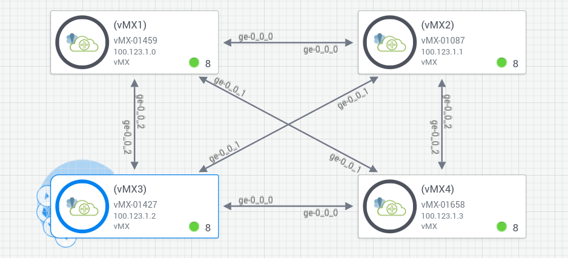

# Junos Intermediate Routing - 3 - BASIC ISIS

ISIS is: 
- an IGP Link State Protocol (Juniper preference is 15 for intra area and 18 for inter areas)
- very similar to OSPF (also uses SPF to determine best path) and has Link State Database.
  - routers in the same area will have the same DB.
- **TLV** : useful for traffic Engineering ; hundreds of types are available, but the most used are:
   - 3 Administrative group (color): used for MPLS
   - 6 IPv4 interface Address
   - 9 Maximum link Bandwidth
   - 10 Maximum Reservable link Bandwidth
   - 11 Unreserved Bandwidth
   - 12 IPv6 Interface Address
- Routers are called **Intermediate Systems (IS)**, hence IS-IS, endhosts are identified as End-Systems
- Has a Designated IS (similar to DR but there is no BDR)
- Has been developed before IPv4 became he norm along so it uses as transport a different of transport/address space  
  called **NET - Network Entity Title** (the family is called **iso** on Juniper), the address consists of:
    - Area ID: 2-6 digits (Hex), always starts with 49
    - System Identifier (S.ID): 12 digits (Hex)
    - NSEL Selector: 2 digits (Hex)
  Format:  [A.ID].[SID].[Selector]
  Example: 
  - 49.0000.0000.0000.00
      -  Area: 49
      -  SID: 0000.0000.0000
      -  Selector: 00
  - 49.6789.1916.8000.0112.00
      -  Area: 49.1921
      -  SID: 1921.0000.0112
      -  Selector: 00
   ```
   lo0 {
       unit 0 {
           family iso {
               address 49.6789.1916.8000.0112.00;
           }
       }
   }   
   ```      

 - only the loopback requires an NET address.. no other addresses are required per device (just enable **iso** family).  
   if you want to route IPs however you will still need one IPv4 per itnerface
 - default metric is 10 and each hop passed adds 10 to the metric ("narrow/default metric")
   - `wide metrics`: this means consider the hop counts for hops outside the area as well
 - **default routes**: aside from normaly ways to create a default route (i.e. *redistribute* or `default-information originate`),  
   in IS-IS, a router generates automatically a default route also when it's a **L1/L2** connected to a **L1** router; in this case  
   the **Attached Bit** is set in the L1/L2 Router in its L1 Link-State PDU (LSP). This indicates to L1 routers that they can reach  
   destinations outside their area through this L1/L2 router. The  L1/L2 router advertises itself as a default route for L1 routers.


There are 3 types of routers:
- Level1: inter area. They only know the topology in their own area
- Level2: backbone router. More than one backbone/L2 areas are allowed
- Level1/2: (default) can perform both intre and itner area connections
  will form L2 adjeciencies outside their area and L1 inside their own area


Packet Types (PDUs):
- Hello: exchanged periodically to establish neghbours and as keep alive monitors; 
  The DIS is elected during the hello exchanges
- **Link State PDU (LSP)**: contains route information (there are many different types of TLVs possible)
  - Complete 
- **Complete Sequence Number PDU (CSNP PDU)**: only sent by the DIS (by default every 10 seconds)
  They contain the list of LSP IDs along with the sequence number and checksum
- **Partial Sequence Number (PSNP PDU):** when an IS sees a CSNP it checks its own DB, if there are inconsistencies,
  it sends out a PSNP requesting the DIS to send the specific LSP back.


Neighbours:
- on point to point links, it will work as normal neighbours (no priority and no DIS election in hello packets)
- On mutli access links, the IS with the highest priority (or mac address) will be elected the DIS. 
  The DIS will form neighbours will IS and send update.  
  Notes:
    - defualt priority is 64, manual value can be set from 0 to 127 
    - normal metrics for neighbours is 10, it is zero when the loopback interface is used
      - each router will list itself as a neighbour
      - the DIS will show itself as a neighbor twice (one physical and one loopback connection)


## Basic configuration




```
#
# NOTE: THE configuration below will setup a single L1 area everywhere
#       during the tests and follow up shows it has been changed a few times
#       in particular R2,R4 will become in the end pure L2 routers in area:  
#       49.0000.0000.0000.0002, 49.0000.0000.0000.0004
#
[R1]
#
# enable ISIS address in the interfaces
set interfaces ge-0/0/0 unit 0 family iso
set interfaces ge-0/0/0 unit 0 family inet address 192.168.12.1/24
set interfaces ge-0/0/1 unit 0 family iso
set interfaces ge-0/0/2 unit 0 family inet address 192.168.14.1/24 
set interfaces ge-0/0/2 unit 0 family iso
set interfaces ge-0/0/2 unit 0 family inet address 192.168.13.1/24 
#
# set the NET Identity title (address) on the loopback
set interfaces lo0 unit 0 family iso address 49.0000.0000.0000.0001.00
set interfaces lo0 unit 0 family inet address 1.1.1.1/32
#
# Enable the interfaces inside the protocol
set protocols isis interface ge-0/0/0.0 level 2 disable
set protocols isis interface ge-0/0/1.0 level 2 disable
set protocols isis interface ge-0/0/2.0 level 2 disable
set protocols isis interface lo0.0


#
#
#  NOTE: R2 will change to have first one interface as
#
[R2]
#
# enable ISIS address in the interfaces
set system host-name R2
set interfaces ge-0/0/0 unit 0 family iso
set interfaces ge-0/0/0 unit 0 family inet address 192.168.12.2/24  ! need to enable IPv4 to exchange IPv4 routes
set interfaces ge-0/0/1 unit 0 family iso
set interfaces ge-0/0/1 unit 0 family inet address 192.168.23.2/24 
set interfaces ge-0/0/2 unit 0 family iso
set interfaces ge-0/0/2 unit 0 family inet address 192.168.24.2/24 
!
! you can setup ports to be point-to-point (nee to match at both sides)
! set protocols isis interface ge-0/0/0.0 point-to-point      
! set protocols isis interface ge-0/0/1.0 point-to-point
! set protocols isis interface ge-0/0/2.0 point-to-point


#
# set the NET address on the loopback
set interfaces lo0 unit 0 family iso address 49.0000.0000.0000.0002.00
set interfaces lo0 unit 0 family inet address 2.2.2.2/32            ! we advertise the Lo IP
#
# Enable the interfaces inside the protocol
set protocols isis interface ge-0/0/0.0 level 2 disable
set protocols isis interface ge-0/0/1.0 level 2 disable
set protocols isis interface ge-0/0/2.0 level 2 disable
set protocols isis interface lo0.0


[R3]
#
# enable ISIS address in the interfaces
set interfaces ge-0/0/0 unit 0 family iso
set interfaces ge-0/0/0 unit 0 family inet address 192.168.34.3/24 
set interfaces ge-0/0/1 unit 0 family iso
set interfaces ge-0/0/1 unit 0 family inet address 192.168.23.3/24 
set interfaces ge-0/0/2 unit 0 family iso
set interfaces ge-0/0/2 unit 0 family inet address 192.168.13.3/24 
#
# set the NET address on the loopback
set interfaces lo0 unit 0 family iso address 49.0000.0000.0000.0003.00
set interfaces lo0 unit 0 family inet address 3.3.3.3/32            ! we advertise the Lo IP
#
# Enable the interfaces inside the protocol
set protocols isis interface ge-0/0/0.0 level 2 disable
set protocols isis interface ge-0/0/1.0 level 2 disable
set protocols isis interface ge-0/0/2.0 level 2 disable
set protocols isis interface lo0.0


[R4]
#
# enable ISIS address in the interfaces
set system host-name R4
set interfaces ge-0/0/0 unit 0 family iso
set interfaces ge-0/0/0 unit 0 family inet address 192.168.34.4/24 
set interfaces ge-0/0/1 unit 0 family iso
set interfaces ge-0/0/1 unit 0 family inet address 192.168.14.5/24 
set interfaces ge-0/0/2 unit 0 family iso
set interfaces ge-0/0/2 unit 0 family inet address 192.168.24.4/24 
#
# set the NET address on the loopback
set interfaces lo0 unit 0 family iso address 49.0000.0000.0000.0004.00
set interfaces lo0 unit 0 family inet address 4.4.4.4/32            ! we advertise the Lo IP
#
# Enable the interfaces inside the protocol
set protocols isis interface ge-0/0/0.0 level 2 disable
set protocols isis interface ge-0/0/1.0 level 2 disable
set protocols isis interface ge-0/0/2.0 level 2 disable
set protocols isis interface lo0.0


#
#
#
############################### SHOW COMMNADS
#
#
#
R1> show isis interface    
IS-IS interface database:
Interface             L CirID Level 1 DR        Level 2 DR        L1/L2 Metric
ge-0/0/0.0            3   0x1 R2.02             R2.02                  10/10
ge-0/0/1.0            1   0x3 R1.03             Disabled               10/10
ge-0/0/2.0            1   0x2 R1.02             Disabled               10/10
lo0.0                 3   0x1 Passive           Passive                 0/0

R1> show isis adjecency                                                             # -> no multi access areas so no DIS
Interface             System         L State        Hold (secs) SNPA
ge-0/0/0.0            R2              1 Up                    7  0:50:56:be:ab:b8   # -> L1 adjecency with R2
ge-0/0/0.0            R2              2 Up                    6  0:50:56:be:ab:b8   # -> L2 adjecency with R2
ge-0/0/1.0            R4              1 Up                   25  0:50:56:be:9b:4c
ge-0/0/2.0            R3              1 Up                   21  0:50:56:be:5a:dc


R1>  show isis adjacency R2 detail 
R2
  Interface: ge-0/0/0.0, Level: 1, State: Up, Expires in 8 secs
  Priority: 64, Up/Down transitions: 1, Last transition: 00:10:44 ago   <- you can see the priority here
  Circuit type: 3, Speaks: IP, IPv6, MAC address: 0:50:56:be:ab:b8      <- you can see it speaks IP,IPv6 
  Topologies: Unicast
  Restart capable: Yes, Adjacency advertisement: Advertise
  LAN id: R2.02                                                         <-  if we had IP addresss on the interface we would see it here
[...]
#
# As soon as we enable IPv4 on the interfaces we start exchanging routes and we get
#
R1>  show isis adjacency R2 detail 
R2
  Interface: ge-0/0/0.0, Level: 1, State: Up, Expires in 6 secs
  Priority: 64, Up/Down transitions: 1, Last transition: 00:17:29 ago
  Circuit type: 3, Speaks: IP, IPv6, MAC address: 0:50:56:be:ab:b8
  Topologies: Unicast
  Restart capable: Yes, Adjacency advertisement: Advertise
  LAN id: R2.02, IP addresses: 192.168.12.2
#
#
R1> show route 

inet.0: 7 destinations, 7 routes (7 active, 0 holddown, 0 hidden)
+ = Active Route, - = Last Active, * = Both

[...]
2.2.2.2/32         *[IS-IS/15] 00:00:28, metric 10
                    >  to 192.168.12.2 via ge-0/0/0.0

#
#
#
R1# run show isis database                --> you will not see IP from here but you can go into detail for a router
IS-IS level 1 link-state database:
LSP ID                      Sequence Checksum Lifetime Attributes
R1.00-00                         0x8   0x69b1      899 L1 L2
R1.02-00                         0x2   0x990e      789 L1 L2
R1.03-00                         0x2   0xd8cb      789 L1 L2
R2.00-00                         0x8   0xc339      882 L1 L2
R2.02-00                         0x2   0x3573      767 L1 L2
R2.03-00                         0x2   0xbae8      769 L1 L2
R3.00-00                         0x5   0x4c2e      823 L1 L2
R4.00-00                         0x5   0x75f9      920 L1 L2
R4.02-00                         0x2   0x128c      903 L1 L2
R4.03-00                         0x2   0xc4da      920 L1 L2
  10 LSPs

IS-IS level 2 link-state database:
LSP ID                      Sequence Checksum Lifetime Attributes
R1.00-00                         0x7   0x1f77      900 L1 L2
R2.00-00                         0x7   0x8404      898 L1 L2
R2.02-00                         0x2   0x3573      769 L1 L2
  3 LSPs

#
#
R1# run show isis database R3 detail                         <-- L1 only Router
IS-IS level 1 link-state database:

R3.00-00 Sequence: 0x7, Checksum: 0xcc25, Lifetime: 901 secs
   IS neighbor: R1.02                         Metric:       10    <- these are R3 neighbours
   IS neighbor: R2.03                         Metric:       10    <- these are R3 neighbours
   IS neighbor: R4.02                         Metric:       10    <- these are R3 neighbours
   IP prefix: 3.3.3.3/32                      Metric:        0 Internal Up
   IP prefix: 192.168.13.0/24                 Metric:       10 Internal Up
   IP prefix: 192.168.23.0/24                 Metric:       10 Internal Up
   IP prefix: 192.168.34.0/24                 Metric:       10 Internal Up


R1# run show isis database R2 detail --> this will show:
IS-IS level 1 link-state database:                                  -> Level 1

R2.00-00 Sequence: 0x8, Checksum: 0xc339, Lifetime: 800 secs
   IS neighbor: R2.02                         Metric:       10      -> neighbour with pseudo node
   IS neighbor: R2.03                         Metric:       10
   IS neighbor: R4.03                         Metric:       10
   IP prefix: 2.2.2.2/32                      Metric:        0 Internal Up
   IP prefix: 192.168.12.0/24                 Metric:       10 Internal Up

R2.02-00 Sequence: 0x2, Checksum: 0x3573, Lifetime: 685 secs        -> this is the pseudo node
   IS neighbor: R1.00                         Metric:        0
   IS neighbor: R2.00                         Metric:        0

R2.03-00 Sequence: 0x2, Checksum: 0xbae8, Lifetime: 688 secs
   IS neighbor: R2.00                         Metric:        0
   IS neighbor: R3.00                         Metric:        0

IS-IS level 2 link-state database:                                  -> Level 2

R2.00-00 Sequence: 0x7, Checksum: 0x8404, Lifetime: 816 secs
   IS neighbor: R2.02                         Metric:       10
   IP prefix: 1.1.1.1/32                      Metric:       10 Internal Up
   IP prefix: 2.2.2.2/32                      Metric:        0 Internal Up
   IP prefix: 192.168.12.0/24                 Metric:       10 Internal Up

R2.02-00 Sequence: 0x2, Checksum: 0x3573, Lifetime: 687 secs
   IS neighbor: R1.00                         Metric:        0
   IS neighbor: R2.00                         Metric:        0

! Note: you will see entries in the DB also for routers that are not directly attached


# run show isis overview
  instance: master
  Router ID: 2.2.2.2
  Hostname: vMX-addr-0
  Sysid: 0000.0000.0002
  Areaid: 49.0000
  Adjacency holddown: enabled
  Maximum Areas: 3
  LSP life time: 1200
  Attached bit evaluation: enabled
  SPF delay: 200 msec, SPF holddown: 5000 msec, SPF rapid runs: 3
  IPv4 is enabled, IPv6 is enabled
  Traffic engineering: enabled
  Traffic engineering v6: disabled
  Restart: Disabled
    Helper mode: Enabled
  Layer2-map: Disabled
  Source Packet Routing (SPRING): Disabled
  Post Convergence Backup: Disabled
  Level 1
    Internal route preference: 15
    External route preference: 160
    Prefix export count: 0
    Wide metrics are enabled, Narrow metrics are enabled
  Level 2
    Internal route preference: 18
    External route preference: 165
    Prefix export count: 0
    Wide metrics are enabled, Narrow metrics are enabled


# run show isis statistics  
IS-IS statistics for vMX-addr-0:
PDU type       Received    Processed        Drops         Sent       Rexmit
LSP                   0            0            0            0            0
IIH                   0            0            0            0            0
CSNP                  0            0            0            0            0
PSNP                  0            0            0            0            0
Unknown               0            0            0            0            0
Totals                0            0            0            0            0

Total packets received: 0 Sent: 0

SNP queue length: 0 Drops: 0
LSP queue length: 0 Drops: 0
SPF runs: 2
Flex Algo Full SPF runs: 0
Flex Algo Partial SPF runs: 0
Fragments rebuilt: 2
LSP regenerations: 0
Purges initiated: 0

[edit]


```

## BFD, AUTHENTICATION AND METRICS

In order to enable **BFD** you need to use **family inet** inside the **protocol isis**


```
# set protocols isis interface ge-0/0/0.0 family inet bfd-liveness-detection ?     
Possible completions:
[...]
  minimum-interval     Minimum transmit and receive interval (1..255000 milliseconds)
  minimum-receive-interval  Minimum receive interval (1..255000 milliseconds)
  multiplier           Detection time multiplier (1..255)
> transmit-interval    Transmit-interval options


# set protocols isis interface ge-0/0/0.0 family inet bfd-liveness-detection minimum-interval 300 multiplier 4

```

Authentication is done at ISIS **Level** and **Interface** (though in my virtual test the command was not available at the itnerface level)

```
# set protocols isis level 2 authentication-type ?
Possible completions:
  md5                  MD5 authentication
  simple               Simple password authentication

# set protocols isis level 2 authentication-key <PWD>
#  set protocols isis level 2 authentication-type md5   
```


IS-IS interfaces have a cost/metric (10 by default) used in the link-state calculatio (lower total path metrics preferred).

IS-IS metrics can have values up to 63. The total path cost is limited to 1023 (This might be not enough)

To support traffic engineering, a second pair of TLVs has been added to IS-IS:
- one for IP prefixes 
- one for IS-IS adjacency and traffic engineering information. 

Using these TLVs, IS-IS metrics can have values up to 16,777,215; these are called wide metrics and are supported/enabled by default.
To generate **only** the new pair of TLVs use: 
```
R# set protocols isis level 2 wide-metrics-only 

```
The combination of wide-metrics-only and traffic-engineering disable configuration options under IS-IS protocols suppresses the combination of the TLVs 2, 22, 128, 134, and 135 IS-IS routing information for that level (The router will still accept them). 
 