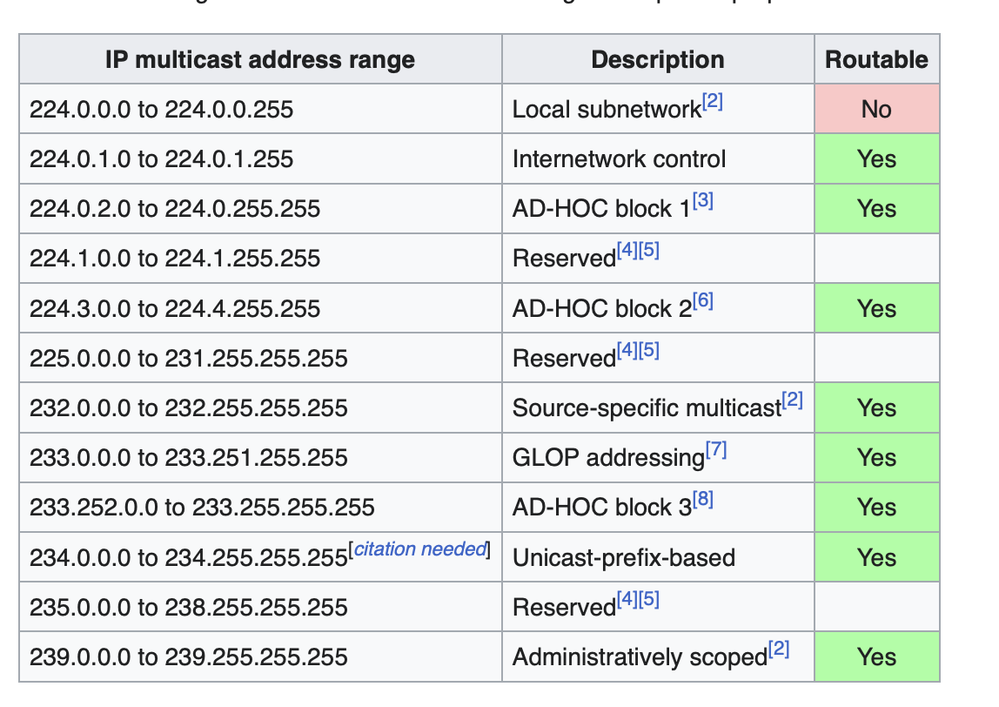

# MULTICAST

Multicast traffic distribution uses the concept of “constrained” flooding, i.e. 
traffic is flooded only on the links that lead to the actual group subscribers. 
The process has 2 parts:
  *  Building a multicast distribution tree for a group—aka Shortest Path Tree or SPT.
  *  Flooding the actual multicast packets down the SPT, while performing Reverse Path
     Forwarding (RPF) to avoid loops.

Multicast ranges are split in sub ranges (see below)



Note also that the multicast Ethernet MAC address range starts at ```01:00:5E:00:00:00``` and goes through ```01:00:5E:7F:FF:FF```.  
Only low-order 23 bits can vary

* The low-order 23 bits of the multicast IP address are mapped into the low-order 23 bits of the MAC address.
* The high order 4 bits of the Layer 3 IP address is fixed to 1110 to indicate the Class D address space between 224.0.0.0 and 239.255.255.255
* As a consequence there are 32 (32-(23+4)=5 and 2^5=32) IP groups that map to the same MAC address

So for instance *224.0.0.5, 224.128.0.5, 225.0.0.5*, etc.. would all be mapped to ```01:00:5e:00:00:05```


# PIM RPF CHECK AND FORWARDING
PIM uses the unicast routing table to perform RPF checks.
When the router receives a multicast packet, it looks at the source IP address for the packet.
The router looks up the source IP address in the unicast routing table and determines the 
outgoing interface for this packet. If this outgoing interface does not match the interface 
where the packet was received, the router drops the packet.

If the RPF check is passed, the router will determine the outgoing interface list (OIL) 
The OIL never includes the input interface; this is the well-known split horizon rule.
PIM needs to be globally enabled:
```
ip multicast-routing distributed
```

Note you can change RPF by adding:
- static routes: carefull as it actually change the routing path
- multicast route: ```ip mroute <SOURCE> <MASK> [RPF-IP-Address|<Interface-Name>] [distance]```  
  This commands only change RPF check behaviour.  
  Note: the mroute table is ordered based on the actul commands, so put the msot specific first

You can debug RPF using:
```
debug ip mfib pak

You might need these 2 as well to actually see the debug
no ip mfib cef input 
no ip mfib cef output
```


Verify commands:
```
show ip pim neighbor
show ip pim interface
show ip mroute   
show ip pim rp mapping

Note that in show ip mroute:
  - the (*,G) will have all the interfaces in the OIL, this entry will have the D flag
  - the (S,G) will have the T bit (traffic in shortest Path)
  - the RP value is 0.0.0.0 (RPF not used)
  - the RPF value is all 0 if the source is directly connected, otherwise it's the upstream neighbor

show ip rpf <source>
will get the information about the RPF interface for a specific source 

show ip igmp interface <intf>
will show 
- the timers on the interface 
- PIM DR and IMP querier
- the groups joined

show ip igmp groups
- to see the groups joined
```

Note:   
You can tunnel multicast to traverse networks that do not support it, however remember:
*  pim needs to be enabled in the tunnel interface
*  the tunnel needs to be in the RPF path


# PIM DENSE MODE

*  Does not use any explicit signaling to create the SPT
*  It floods a packet out of all the interfaces enabled for multicast (except the source interface)
*  if the downstream router does not have subscriber, it will send upstream a **PRUNE** message for the group
   *  as a consequence the link to the downstream router will be removed from OIL
   *  PRUNE MEssage is valid for 3 minutes (default), after that traffic is sent again
*  DM nees to be enabled interface per interface
   ```
   interface <X>
     ip pim dense-mode
   ```


# PIM SPARSE MODE
PIM SM builds explicit multicast distribution trees from the receivers to the sources. 
It uses Rendezvous Point (RP) to faciliate discovery of endpoints (sources/destinations):
*  An RP is a router known to both sources and receivers. 
   *  A Receiver router (for a group: G) first builds a tree to the RP; this is called **SHARED TREE** or (*,G)
      This is done by sending upstream **PIM JOIN** messages toward the RP
   *  When a source appears in the network, the **closest multicast router** will contact the RP 
      using **PIM Register** messages; these messages are encapsulated in a unicast packet and sent to the RP. 
      **Note:** a dynamic (non configurable) Tunnel interface is created on all routers in the PIM network to 
      encapsulate the register messages to the RP
      **Note:** PIM should be enabled along the shortest path to the RP, or the RPF check for the RP will fail 
      and the registration will not be completed.
   *  The RP builds a new SPT toward the source using **PIM Join** messages and starts forwarding traffic down 
      the (*,G) tree. 
   *  When the SPT to the source is created (by the RP) the RP sends a **Register Stop** message 
      Taffic does not need to be incapsulated anymore, it can just follow the SPT to the RP
   *  **SPT switchover**: when the receivers see traffic coming down the (\*,G) tree from a specific source: **S**, they initiate 
       a **PIM Join** toward the source, building another SPT designated as the **(S,G)** (flag will be set to T)
      Also a **Prune** message is sent to the RP as we don't need the traffic from (*,G) anymore 
      Nete: you can set a threshold for the switchover to happen (and possibly disable it completely):
      ```ip pim spt-threshold [<Rate in Kbps>|infinity]```


## PIM SPARSE MODE - STATIC RP
You can configure the RP in a static way (note: static takes precendence over dynamic here):

```
ip pim rp-address <IP> [<ACL>] [override] .
```
The ACL parameter lists the groups that are mapped to this particular RP. 
The **override** parameter will force the router to retain static information even if a different RP for the group 
is learned via Auto-RP/BSR.


## PIM SPARSE MODE - DR ELECTION
If there are multiple multicast routers on the same Multi-access segment, a DR needs to be elected.
The goal of the DR is:
*  To signal the SPT and forward packets when there are receivers on the segment
*  To register active sources on the segment with the regional RP;
   *  When the DR hears multicast packets on the segment, it will check if the group has an RP
   *  If it does, the data packets are encapsulated into **PIM Register** messages and sent to the RP. 
   *  The RP will start forwarding them down the shared tree (if there are subscribers) and build the SPT 
      to the DR
The winner is decided based on:
*  highest priority 
*  highest IP address;
*  The process is preemptive 


## PIM SPARSE MODE - ASSERT

If multiple multicast routers share a single segment, only one, also called **Designated Forwarder** (**DF**) will send traffic to avoid duplication, i.e.
the downstream router would see, accept and forward packets from both.  
*  A router detects that someone is sending traffic for the same (S,G), that is also locally active (S,G)  
   so it originates a PIM Assert message.  
   The message contains the source IP: S, the group: G, and the path cost to the source (AD, Metric).  
*  The Messge is evaluated: best (lowest) AD value wins the assertion 
   *  metric and router ip on the segment are used as possible tie breaker if required 
*  The loser  will remove the (S,G) state on its interface and stop flooding traffic.
*  The winner, it will emit a superior PIM Assert message (so the other router will stop)

**Notes:** 
*  PIM Assert procedure might be dangerous on NBMA interfaces.  
   E.g. e a hub-and-spoke DMVPN; if for the Spoke wins, the hub stops sending multicast;
   The Hub will also not send the traffic to the other spokes as that would violate RPF so
   all other spokes stop receiving traffic.
   Solutions:
   *  use PIM NBMA mode (sparse mode only)
   *  make sure that the hub always wins the PIM Assert.
*  if you use an mroute, the AD advertised is 1 (so it basically always wins)
*


## PIM SPARSE MODE - ACCEPT RP
This is a security feature (for all routers):
```
ip pim accept-rp [<rp-address> | auto-rp] [<access-list-name>]
```
When configured the router will only accept **join/prune** messages for  (*,G) the specific RP
This means a client can't create a SPT through this router if the RP is not the one allowed.
The access-list is used, then only **Join/Prune** messages for the groups in the acl are accepted.

**Notes:** 
*  (S,G) join/prune are not affected
*  auto-rp: when used it means only RP learnt via auto-rp


## PIM SPARSE MODE - ACCEPT REGISTER
This is a security feature (for the RP) :
```
ip pim accept-register [list <Extended-ACL | route-map <Route-Map>]
```
You can specify the sources that are allowed to register with the RP. If the RP denies the registration, 
it sends a **PIM Register-Stop** to the DR immediately and never builds the SPT toward the source. 
**NOTE:** registration is performed by the PIM DR router; every message contains the original  
          multicast packet, which includes the IP address of the multicast source and the group. 


## PIM SPARSE MODE - AUTO-RP
This is actually quite an old protocol, replaced by **BSR**.  
Auto-RP works based on:
*  Candidate RP (CRP) : any router that wants to become an RP
*  Mapping Agents (MA): will forward information about groups and RP

CRP are configured with:
```
ip pim send-rp-announce <Interface> scope <TTL> [group-list <Std-ACL>] [interval <seconds>]
```
These routers will send UDP packets to the IP/Port **224.0.1.39/496** with the list of groups (default is 60 seconds). 
*  `<TTL>` is used to limit the scopeThe interface
*  `<Interface>` must be enabled for PIM and its IP address will be used as the RP’s IP. 
*  `<Std-ACL>` lists the groups for which we want to become the RP  
   Notes: 
   *  wildcard masks are converted to prefix-lengths, so you cannot use discontinuous masks. 
   *  “deny” statements are interpreted as groups that should be trated as "dense" mode  

The cRP announcements are flooded across the network and reach the Mapping Agents that lsiten for **224.0.0.39**.  
You configure these routers using the command:
```
ip pim send-rp-discovery <Interface> scope <TTL> interval <Seconds> . 
```
Mapping Agents compile a list of **Group to RP mappings** and send **“RP discovery”** messages to **224.0.1.40:496**. 
**Notes:** 
*  if there are multiple MAs, they will hear each other, and all of them, except the one with the highest IP address, 
   will cease sending discoveries.
*  if the same group is mapped to multiple RP, the MA will select the the highest RP IP address.
*  if there are two announcements where one group is a subset of another but the RPs are different, both will be sent.
*  All regular routers join the multicast group **224.0.1.40** and listen to the discovery messages and use them to populate
   their cache:
   * Negative entries in the cache/discovery are considered first, groups in negative message will be 
     seen as DENSE and RP info ignored. 
   * Positive Entries are selected based on longest match
   * Note that a single negative entry could blacklist multiple positive (as it is considered first)
*  Groups: 224.0.1.39, 224.0.1.40 are propagated across in **dense mode** thorugh the network. (there is no RP) and
   this requires: ```ip pim sparse-dense-mode``` on all interfaces within the multicast domain. You may also
   want to use the ```no ip dm-fallback``` global command.
   *  An alternative to **spare-dense** mode for 224.0.1.39, 224.0.1.40, is to use **Auto-RP Listener**  
      It will only allows those 2 groups to work in **dense** mode and it does not use sparse-dense on the interface 
      (only normal sprse mode)
   *  In an **NBMA**, you need to place the MA in the Hub and because **ip pim nbma** only works in sparse mode but the 2 groups
      forward traffic in dense mode (the RP can still be some place else)  
*  If you define a static RP for a group but also have Auto-RP, you need to use the option ```override```  
   By default, Auto-RP announcements override a statically configured RP so uf you want them to persist, use
   the override keyword along with the `ip pim rp-address` command.
*  You can do load balancing and redundnacy by setting:
   * RP1 primary for longest match set of prefixes(1), secondary for summarized set of prefixes(2)
   * RP2 primary for longest match set of prefixes(2), secondary for summarized set of prefixes(1)
* you can filter (on Mapping Agents) Auto-RP announcements with:
  ```ip pim rp-announce-filter [group-list <access-list> | rp-list <access-list>]  ```


## PIM Bootstrap Router
BSR, is a standards-based solution available with PIMv2 that performs the same function as Auto-RP.  
BSR does not use any dense-mode groups to distribute RP-to-group mapping information but instead it  
floods information using PIM messages, on a hop-by-hop basis:
*  a router receives a candidate RP announcement inside a PIM message
*  it applies an RPF check, validating that the announcement is on the SPT to the RP
*  If the RPF check succeeds, the message is flooded out of all PIM-enabled interfaces.
To configure a candidate RP, use the command:
```
ip pim rp-candidate <PIM-Enabled-Interface> [group-list <Standard-ACL>] [interval <Seconds>] [priority <0-255>] .
```
**Notes:**
*  If you omit all arguments, the router will start advertising itself as the RP for all groups. 
*  You may specify a list of groups using the group-list argument (you cannot use *“negative”* groups).  
*  Priority value is used when the routers select the best RP for a given group (lower is prefered, default is zero)
   You can change the priority of an RP if you want to gracefully shut it down
*  you can filter BSR messages with the interface command: ```ip pim bsr-border```: message will not be flooded or
   accepted on that link 

The BSR (similar to MA agent) router builds, for every group range a set of candidate RPs called: the group range  
to RP set mapping. The resulting array of group range to RP set mappings is distributed by the BSR using PIM messages  
and the same flooding procedure described above.  
The command to configure a router as a **BSR** is:
```
ip pim bsr-candidate <Interface-Name> [hash-mask-length] [priority] . 
```
By default, the priority of zero is advertised in all BSR messages. The **higher** the priority value, the **more preferred**  
the BSR. The IP address of the interface used to source the BSR messages is used as a tie-breaker; if two priorities match,  
the higher IP is preferred. 
If there are multiple BSRs, they all listen to other potential BSR messages. If a BSR hears a message with a higher priority  
or IP address, it immediately stops its own BSR advertisements.  
To facilitate RP load-balancing, routers may use a special **hash** function to select the best RP from a set that services  
the same group range.


## PIM MULTICAST BOUNDARY
This feature applies filtering to both the control plane traffic (IGMP, PIM, AutoRP) and 
the data plane (installing multicast route states out of the configured interface). 
You can use it to contain multicast by applying:
```
ip multicast boundary <access-list> [filter-autorp] 
```
to an interface; the following rules apply:
*  If the access-list is a standard ACL, any ingress **IGMP or PIM** messages are inspected 
   to see if the group being joined or tree being built has a match in the ACL. The interface
   can be used for a group in the ACL
*  If the access-list is an extended ACL, it specifies both multicast sources and groups, using  
   the format permit ip ```<src-ip> <src-wildcard> <group-address> <group-mask>```; PIM/IGMP is inspected
   and matched against the ACL to see if they are allowed. Same for actual traffic.
*  **unicast PIM Register** messages are not affected by the multicast-boundary configuration and must be 
   filtered using the respective feature.


# PIM SPARSE DENSE MODE
PIM Sparse-Dense mode is a hybrid of the Sparse and Dense mode operations. When you apply the command:  
```ip pim sparse-dense-mode``` to an interface, the router will forward traffic for both sparse and 
dense groups out of this interface.  
This means, if you hav an RP for a group it will use SPARSE mode otherwise it will use DENSE mode.  
(This is useful in cases where the RP is learn dynamically, but overall **DO NOT USE IT**)  
Use the command: ```no ip pim dm-fallback``` on all PIM SM/DM routers to prevent the DM fallback behavior 
and only allow forwarding for sparse-mode groups.


# STUB MULTICAST AND IGMP HELPER
You can use this feature on spoke routers with low resources where you don't want to handle PIM messages.  
A router cab configure to just forward the **IGMP Messages** they see locally to a **HUB** router.
The **HUB** router will see IGMP requests and handle **PIM state**
**NOTES:**
*  The spoke router is configured with 
   ```
   interface <X>
     description multicast uplink
     ip pim dense-mode
     ip igmp helper-address <HUB IP ON THE LINK>
   ```
*  The HUB router is configured with:
   ```
   interface <Y>
     description link to spoke
     ip pim sparse-mode
     ip pim neighbor-filter <standard_acl>
   ```   
   the filter is applied to avoid to create a neighbor with the spoke (the acl should have a deny for the spoke ip)


# IGMP ( FILTERING )   
IGMP is the protocol used by multicast receivers to communicate their willingness to listen to a particular multicast group.  
When a host wants to join a multicast group, it sends an **IGMP membership report** message to the multicast address for all routers ```224.0.0.2```.  
This report contains the multicast group that the host wants to join.  
The multicast router may control groups allowed with the interface command: ```ip igmp access-group <ACL>```; Note that you could also use: ```ip multicast boundary``` , but
ip the igmp command is more common.   
Note that: 
*  if `<ACL>` is a standard access-list, the filter will be applied on the group IP. 
*  If `<ACL>` is an extended access-list, this will apply alo to IGMPv3 reports that allows to speficy Sources and Groups

The command: ```ip igmp limit <N>``` can instead be applied globally or per interface and it limits the number of multicast group joined by connected receviers (globally or per interface)

The **IGMP membership report** messages sent by clients can be missed so one of the routers in the segment is elected as **IGMP Querier** and periodcally queries all hosts by sending **Membership Queries**; clients should respond with the list of **groups** they want to join
The **IGMP Querier** is elected as the router with the **lowest IP** in contrast with the **PIM DR** which is elected using the highest IP.

### IGMP Timers

```
intf <X>
 ! sends Membership queries every <N> seconds  
 ip igmp query-interval <N>

 ! if no queries are heard after <M> seconds, try to become the Querier
 ip igmp querier-timeout <M>  


```
Notes:  
* IGMP v1 does not have explicit LEAVE messages so multicast is sent until a timer expires with no requests for a group
 ```ip igmp query-max-response-time [time-in-seconds]```
* Response to IGMP Membership Queries are broadcasted in the LAN so that when a host replies, the others will know it and not send any other response
*  if an IGMP v2 LEAVE Message is sent, the querier need to check if there are other cliets and sends out **Last Member Query**; the number of these queries (default: 2) is controlled by ```ip igmp last-member-query-count <N>``` and the time it wait for a response (default: 1sec)is controlled by ```ip igmp last-member-query-interval <milliseconds>``` 
   *  if we know for sure that there is only a client the router can be configured to immediately stop the traffic and leave the group with: ```ip igmp immediate-leave group-
list <access-list> ```

# IGMP SNOOPING
Switches may selectively prune some ports from unneeded multicast traffic. This procedure is called IGMP snooping and allows for selective multicast flooding in switched networks.
By default igmp snooping is active but you can disable it with the command: ```no ip igmp snooping vlan <VLAN-ID>```  
You can also check the current state with the command: ```show ip igmp snooping groups vlan <VLAN-ID>```


# Multicast Helper Map
The purpose of this feature is to allow forwarding of broadcast traffic across a multicast capable network.   
Broadcast UDP packets can be relayed between two subnets using:  ```ip helper-address```, which converts the broadcast destination address to a fixed unicast IP address.  
In the same way, **Multicast helper**:  ```ip multicast helper-map```, converts the broadcast destination to a fixed multicast address.  
See a configuration example:
```
R1:
    ip multicast-routing distributed
    ! This enables the forwarding of UDP broadcast packets to port 5000
    ip forward-protocol udp 5000
!
! intercepts all traffic on UDP porta 53/5000
    ip access-list extended TRAFFIC
     permit udp any any eq 5000
     permit udp any any eq 53
!
! this is the interface where the boradcast is received
    interface GigabitEthernet1.146
     ip pim dense-mode
     ip multicast helper-map broadcast 239.1.1.100 TRAFFIC


R2
     ip multicast-routing distributed
     ip forward-protocol udp 5000
!
     ip access-list extended TRAFFIC
      permit udp any any eq 5000
      permit udp any any eq 53
!
! This is the interface where multicast is received
     interface GigabitEthernet1.58
      ip pim dense-mode
      ip multicast helper-map 239.1.1.100 155.1.108.255 TRAFFIC
!
! This is the interface where the broadcast is regenerated
     interface GigabitEthernet1.108
      ip pim dense-mode
      ! This to enable a broadcast (255.255.255.255 would be used)
      ip directed-broadcast
      ! this is to change the broadcast address
      ip broadcast-address 155.1.108.255
```

# BIDIRECTIONAL PIM (PIM BiDir)
This is an extension of PIM SM concept that uses only the shared tree for multicast distribution.   
This mode of operation is useful in situations where most receivers are also senders at the same time (e.g. videoconferencing but also vxlan deployments where LEAF are both senders and receivers).  
**PIM BiDir uses a single distribution tree rooted at the RP**. (Note: if there are multiple RPs, there could be many BiDir trees).  
To build the bi-directional tree, PIM elects **designated forwarders (DFs)** on every link in the network: i.e. the router with the shortest metric to reach the RP. **DF routers** are the only routers allowed to forward traffic toward the RP (this is considered the **“upstream”** portion of the BiDir tree).  
Every router in the multicast domain creates a (\*,G) state for each BiDir group, with the OIL built based on PIM Join messages received from its neighbors. This is the **“downstream”** portion of the BiDir tree.  
Now:
* A router creates (*, G) entries only for bidirectional groups. The list of a (*, G) entry includes all the interfaces for which the router has been elected DF and that have received either an IGMP or PIM Join message. 
* packets received on a valid RPF interface toward the RP is forwarded based on the OIL. 
* packets received on interfaces not toward the RPF are going to be sent to the RP, if the router is the DF for that segment.


Notes:
*   PIM BiDir does not utilize the source registration procedure, via PIM Register/Register-Stop messages.   
   *  Every source connected to a PIM BiDir capable router may start sending at any time
   *  The packets will flow upward to the RP (not incapsulated). 
   *  After reaching the RP, packets are either dropped, if there are no receivers for this group 
      (i.e, the OIL for (*,G) is empty), or forwarded down the BiDir tree.
      *  This means that ```ip pim accept-register``` will not work with PIM BiDir, because there are    
         **“register-stop”** messages.
* Note: an interesting use of PIM Bidr is with VXLAN in case the of a flood and learning configuration; The Spines are usually configured as anycast RP, they synchronize using MSDP.
* PIM BiDir is not supportedd on GRE interfaces 
* The IP Address of the RP **does not need to be assigned to a router/device**

Configuration is simple:
* Enable BiDir PIM on all multicast routers with:  ```ip pim bidir-enable``` 
* Designate particular RP/Group combinations as bi-directional.  
  You can do this in the following ways:
  *  Use a static RP configuration with the command ```ip pim rp-address <IP> <ACL> bidir``` .
  *  Use **BSR** or RP information dissemination, you may flag particular group/RP combinations as bi-directional with:  ```ip pim rp-candidate <interface> group-list <ACL> bidir``` 
     * Note: BSR does not support **phantom RP**, i.e. advertising an RP IP that matches no interfaces.
  * Use **Auto-RP** for RP information dissemination, you may flag particular group/RP combinations as bi-directional using the syntax ```ip pim send-rp-announce <interface> scope <TTL> group-list <ACL> bidir``` .

  Sample config:
  ```
  Note: we use in this config auto-rp to announce a phantom RP
  but we don't show a mapping agent config here.

  [Primary RP]
  interface Loopback1
    ip address 192.168.3.1 255.255.255.252                ! Loopback in same subnet as RP IP mask is /30
    ip pim sparse-mode
    ip ospf network point-to-point                        ! used so the mask is sent out
  !
  ip pim send-rp-announce 192.168.3.2 scope 16 bidir      ! use auto-rp to announce: 192.168.3.2 as the RP
  !
  router ospf 1
    router-id 192.168.2.100                               ! remember fix the router id (we assume this is Lo0 IP)
  ...
  

  [Backup RP]
  interface Loopback1
    ip address 192.168.3.1 255.255.255.248                ! same IP (could be different) but largert mask: /29
    ip pim sparse-mode
    ip ospf network point-to-point
  !
  ip pim send-rp-announce 192.168.3.2 scope 16 bidir
  !
  router ospf 1
    router-id 192.168.2.101
  ...
  ```


# SOURCE SPECIFIC MULTICAST (PIM-SSM)
IGMPv3 is requried for PIM Source Specific Multicast (SSM) because receivers can specify the sources that they want to listen to **explicitly**.  
The host can ask to join **group G** at **source S**.  
PIM SSM builds shortest-path trees (SPT) **only toward the sources**; There are no shared trees in PIM SSM and **no RPs are used**.  
Configuring **PIM SSM** is straight-forward, because it uses regular PIM
messages. You need to:
*  Specify the groups that are using SSM with the command ```ip pim ssm range {default|range <Standard-ACL>}``` . 
    * The **default** keyword means that the range **232.0.0.0/8** is used. 
    * For the groups in the SSM range, no shared trees are allowed and the (*,G) joins are dropped.
*  Enable IGMPv3 on the interfaces connected to the receivers capable of using this protocol. Without IGMPv3, there can be no use of PIM SSM.
#

# MULTICAST BGP EXTENSION
Multicast BGP extension are usually required if you want to exchange multicast traffic betweene different administrative domains.  
In particular you need to:

* Enable PIM between the two domains, to allow signaling of shared and shortest-path trees between them.  
  Each domain usually has its own set of RPs, so you should prevent **BSR/Auto-RP** information from leaking between the domains. Note: a special protocol called **MSDP** is used to exchange information about the sources in the different domains.
* To allow routers performing RPF checks, you must exchange information on routes toward the multicast sources in each domain. 
  You can use routes learned via either IGP or BGP but BGP is most commonly used to exchange this routing information.

In some cases, you may want to apply different policies to unicast-specific routes exchanged via BGP (e.g. force multicast traffic on specific links),so you can use **Multi-Protocol BGP extensions**.  
You can exchange prefixes under the **“multicast” address-family** and apply a different policy to this information.  
* These prefixes are interpreted in the same way as the **mroute** command information (static mroutes);
  i.e. they are used for RPF checks on the router that receives them. 
  * A prefix is learned via multicast BGP extension, it is assumed to have RPF neighbor toward the next-hop IP address found in the update. 
  * This information is propagated via BGP to every neighbor configured for the multicast address family.
  * Multicast prefixes are subject to the same best-path selection procedure, so you may use the same methods of path manipulation that you used with unicast prefixes. 
#


# MULTICAST SOURCE DISCOVERY PROTOCOL (MSDP)

**MSDP** is used to exchange multicast source information between RPs. It is configured as a TCP connection between the RPs and used to exchange the so-called **Source Active (SA)** messages.  
All MSDP peerings are configured manually, using the command: 
```
[ios based]
ip msdp peer <PEER_IP> connect-source <source_intf> remote-as <remote_as>

[nxos based]
ip pim rp-address <rp> group-list <multicast_address/mask>
ip pim anycast-rp <rp> <peer_ip>
``` 
at both endpoints.   
How it works:
* A source in one PIM SM domain starts sending the multicast traffic
* The respective DR will start the registration process with the local RP
* The local RP receives the PIM Register message, it replicates it to all of its MSDP
neighbors as an SA message. The SA message contains: 
  * the **IP address of the source** 
  * the destination group 
  * the IP address of the RP sending the SA message. This is known as the **MSDP ID** and can be changed using the command ```ip msdp originator-id <IP>```.
* A MSDP Peer RP receives the SA message and:
  * it determines whether there are local receivers for the group
  * If there are, the message is forwarded down the tree, allowing the receivers to learn about the sources in another domain. 
*  The receivers at this point join/create the SPT toward the source in the other domain. **Note:** This is only possible if the source IP address is learned via BGP or some other protocol. 
* Periodic and empty (as in no actuall data) SA messages are used instead to refresh the active state for this group/source.

**Notes for RPF:**
SAs messages can be relayed from RP to RP in a chain so, to avoid loops:
* MSDP SA messages are alo subjected to RPF check: MSDP peer forwards SAs only if they pass the RPF check performed against the RP IP address (originator-ID) inside the message and the IP address of the MSDP peer that relayed the message. 
* If the MSDP peer is on the shortest path toward the originating RP, the message is accepted; otherwise it is dropped. 
* If routing information is missing, you may use the command ```ip msdp default-peer``` to identify the upstream RP that forwards SA messages. **RPF checks are not applied to default peers, and all SA messages are accepted**.

# ANYCAST RP
Anycast RP is a special RP redundancy scenario that allows using redundant RPs sharing the same IP address.  
**Anycast** means that groups of RPs use the same IP address used by all multicast routers in the domain to build shared trees:  
* PIM Joins are being sent to the closest RP, based on the unicast routing table. Routers might join shared trees rooted at different RPs. 
* Different DRs will pick up different physical RPs based on the anycast address to register their local sources.
* To maintain consistent source information, **MSDP** sessions should be configured between the RPs. Note that it can all be in the same AS

Becasue all routers use the same RP, if one fails, after the routing (typically IGP)  converges, the other one becomes available (no reconfiguration needed)

**NOTEs:** 
* Because all routers are configured with the same Loopback IP, be sure the **router-id** in the routing protocols is manually set or defined correctly. This is because many routing protocols will get their rotuer-id from a (highest?) loopback so you might end up with differnt routers using the
same **router-id**
* an interesting use of anycast RP and MSDP is with VXLAN.. in case Multicast is used for flood and learn, you want to configure 
multiple RPs and keep them up-to-date
* The difference with **Phantom RP** is that anycast RP are using actual interface IPs (always the same for all routers) 
