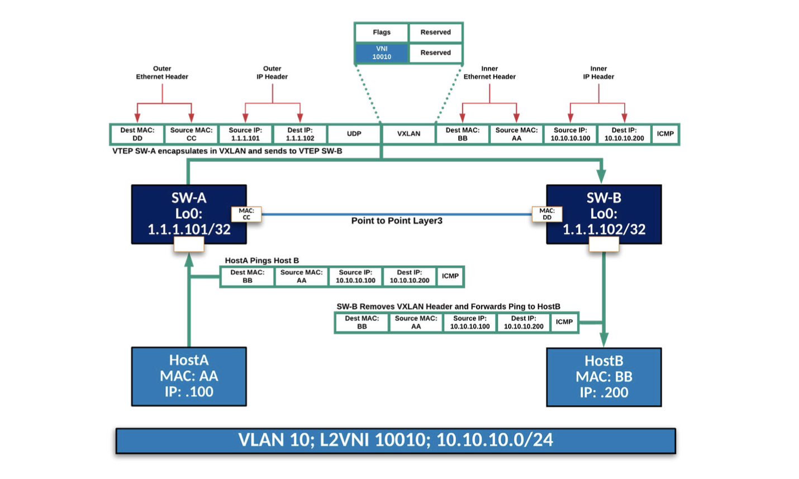

# VXLANs ( RFC 7348)

These notes are taken from both Arista **EVPN deployment guide** and Nexus VXLAN deployment guides/whitepapers

Virtual Extensible LAN (VXLAN) is a IP/UDP encapsulation technology that enables the extension of Layer-2 broadcast domains over IP transport:
* VLANs are mapped to: VNIs (VXLAN Network Identifiers) which are a **24bit** value
* a method to distribute Broadcast is also required.
* Up to 54 bytes are added to the original Ethernet frame and the Don’t Fragment (DF) bit is set, so:
  * a minimum MTU of 1554 bytes is required or better use **jumbo frames** with MTU to 9214 bytes.
* the VXLAN packet SRC and Destination IPs are the local and remote VTEP IPs
* the VXLAN header includes:
  * Flags and VNI ID (as per local knowledge)
  * the original Ethernet Frame

## VXLAN Bridge and L2VNI

**L2VNI** are used for VXLAN bridging (e.x. traffic from Host A to Host B):

1.  SW-A receive a packet from Host A
    * SRC Mac is Hosst-A mac, SRC IP is Host-A IP
    * Dest Mac is SW-A mac, Dest IP is Host-B IP 
2. SW-A has VLAN 10 mapped to VNI 10010
3. SW-A encapsulates the ethernet frame in a new IP packet:
   * The VXLAN header records the VNI: 10010
   * the original frame is encapsulated (no changes)   
4. VTEP SW-B receives the VXLAN packet
   * Sees VNI 10010 in the VXLAN Header
   * has VNI 10010 locally mapped to VLAN 10
6. SW-B removes the VXLAN header, performs the lookup and forwards the packet in VLAN 10
7. Host-B sees the packet with Src Mac: Host-A Mac and SRC IP: HOst-A IP

The VNI even if configured **locally** has a **global** value if things need to be kept consistent.

## Broadcast, Unknown Unicast and Multicast (BUM).
To resolve a Host MAC address, an ARP request is sent in broadcast on the segment. Once a VTEP receives a broadcast frame, it must ensure that all VTEPs with endpoints within the respective broadcast domain receive a copy of that frame.  

There are different methods to distribute BUM traffic:
*  **Multicast**: VNIs are mapped to multicast groups on either a 1:1 or N:1 basis.  
   VTEPs then become both Senders and Receivers for the multicast groups
   Arista does not support this in the context of EVPN.  
*  **Head End Replication (HER)**. Every VTEP maintains a list of all other VTEPs that are interested in receiving BUM traffic for a given VNI.  
   This is referred to as a ***Flood List***, and can be either manually maintained via static entries, or dynamically populated via the EVPN control-plane.
   In this case a unique copy of that frame is sent to each respective VTEP within the flood list.

# Ethernet Virtual Private Network (EVPN) Overview.

**EVPN** is an address-family within **BGP** (AFI: 25, SAFI: 70), and provides a control-plane to enable L2VPN and L3VPN services.

EVPN control-plane enables VTEPs:
*  To signal to other VTEPs which VNIs they are interested in receiving BUM traffic for. 
*  To learn/advertise information about endpoints within the environment, in particular:
   *  MAC Address/ IP Address (/32 Host Route)
   *  Layer2 VNI (VLAN) / Layer3 VNI (VRF) Membership
   *  Which VTEP the endpoint resides behind
   *  Mobility tracking number (If endpoint moves behind different VTEPs)
* The use of techniques such as ARP suppression: where VTEPs reply to ARP requests on behalf of the destination endpoint. 
* To originate native IPv4 Unicast Prefixes, and signal to other VTEPs, via the **L3VNI**, which **VRF (L3VPN)** the IP prefix is a member of. 

## EVPN route-types 
There are currently 5 route-types defined but only 3 are mostly used: **Route-Types 2, 3 and 5** while **Route-type1 and 4** are used for multi homing.

* **Route-Type 2:** this is MAC-IP it contains a mapping between Host IP and Mac address
This NLRI includes fields like (it includes more.. but these are the more meaningful):
  * Host Ethernet Mac 
  * Host IP address
  * L2VNI: 3 octects, note that this field is actually called MPLS Label1
  * L3VNI: 3 octects, note that this field is actually called MPLS Label2  
  * RD of the VTEP advertising it.  
    Note that if we have a pair of LEAF, they will have different RDs and this way a host route-type2 is going to be duplicated in BGP ; this is good however because in case one LEAF goes down, the second entry is already available.  
  * Addes as extended community also RT  
* **Route-Type 3:** IMET (Inclusive Multicast Ethernet Tag), this is used to advertise otehr VTEPs that we are interested in getting **BUM** traffic for a specific **VNI**
* **Route-Type 5** This NLRI includes fields like (it includes more.. but these are the more meaningful):
   