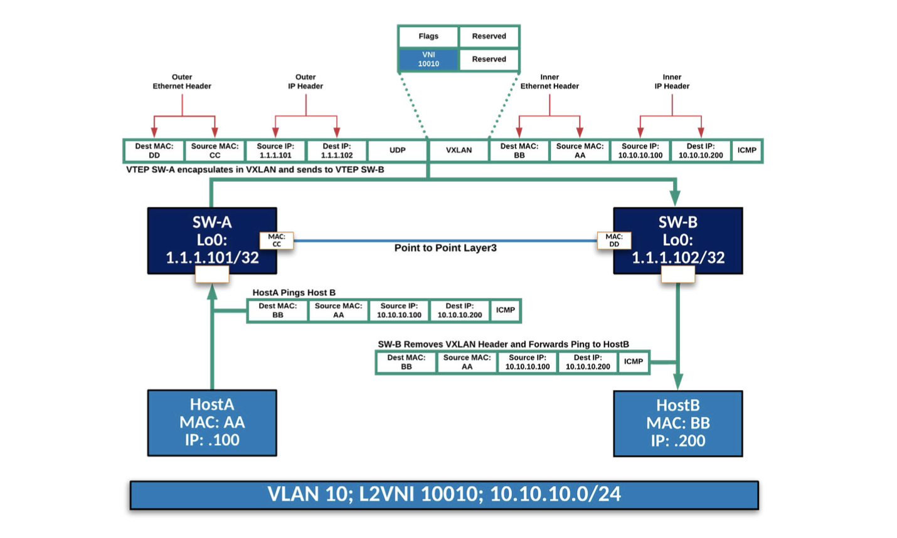
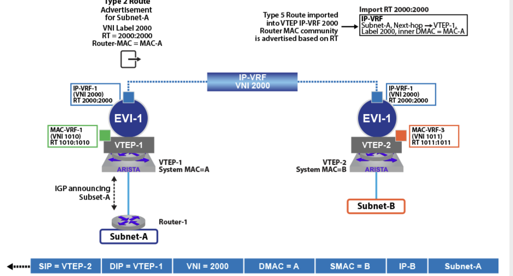
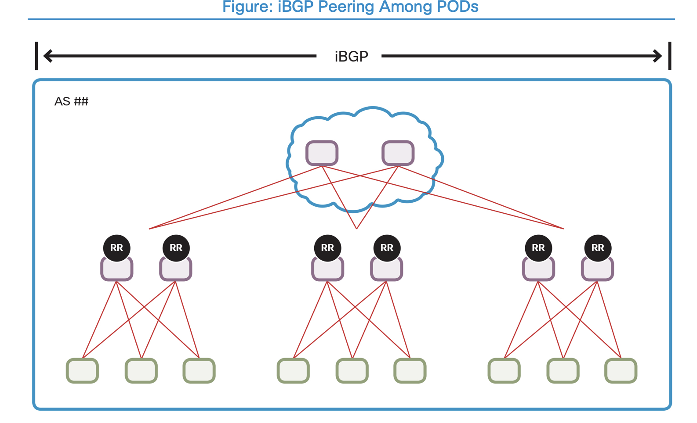

# VXLANs ( RFC 7348)

These notes are taken from both Arista **EVPN deployment guide** and Nexus VXLAN deployment guides/whitepapers


Virtual Extensible LAN (VXLAN) is a IP/UDP encapsulation technology that enables the extension of Layer-2 broadcast domains over IP transport:
* VLANs are mapped to: VNIs (VXLAN Network Identifiers) which are a **24bit** value
* a method to distribute Broadcast is also required.
* Up to 54 bytes are added to the original Ethernet frame and the Don’t Fragment (DF) bit is set, so:
  * a minimum MTU of 1554 bytes is required or better use **jumbo frames** with MTU to 9214 bytes.
* the VXLAN packet SRC and Destination IPs are the local and remote VTEP IPs
* the VXLAN header includes:
  * Flags and VNI ID (as per local knowledge)
  * the original Ethernet Frame

## VXLAN Bridge and L2VNI


**L2VNI** are used for VXLAN bridging (e.x. traffic from Host A to Host B in the same VLAN):

1.  SW-A receive a packet from Host A
    * SRC Mac is Host-A mac, SRC IP is Host-A IP
    * Dest Mac is Host-B mac, Dest IP is Host-B IP 
2. SW-A has VLAN 10 mapped to VNI 10010
3. SW-A encapsulates the ethernet frame in a new IP packet:
   * The VXLAN header records the VNI: 10010
   * the original frame is encapsulated (no changes)   
4. VTEP SW-B receives the VXLAN packet
   * Sees VNI 10010 in the VXLAN Header
   * has VNI 10010 locally mapped to VLAN 10
6. SW-B removes the VXLAN header, performs the lookup and forwards the packet in VLAN 10
7. Host-B sees the packet with Src Mac: Host-A Mac and SRC IP: Host-A IP

The VNI even if configured **locally** has a **global** value if things need to be kept consistent..  
This meanss you could map athe same VNI to two different VLANs in two different VTEPs and bridge their
L2 domain.. however it's probably not a good idea.

## Broadcast, Unknown Unicast and Multicast (BUM).
To resolve a Host MAC address, an ARP request is sent in broadcast on the segment. Once a VTEP receives a broadcast frame, it must ensure that all VTEPs with endpoints within the respective broadcast domain receive a copy of that frame.  

There are basically 2 different methods to distribute BUM traffic:
*  **Multicast**: VNIs are mapped to multicast groups on either a 1:1 or N:1 basis.  
   VTEPs then become both Senders and Receivers for the multicast groups
   Arista does not support this in the context of EVPN.  
*  **Head End Replication (HER)**. Every VTEP maintains a list of all other VTEPs that are interested in receiving BUM traffic for a given VNI.  
   This is referred to as a ***Flood List***, and can be either manually maintained via static entries, or dynamically populated via the EVPN control-plane.
   In this case a unique copy of that frame is sent to each respective VTEP within the flood list.

**Note:** I'm not mentioning above EVPN because EVPN has a way to reduce BUM traffic by sharing the mac-ip knowedge etc.. but if there is still BUM traffic it needs to still use either Multicast or Head End Replication.


## Symmetric vs Asymmetric VXLAN routing.

When the packet is forwarded inside the same L2 domain VNI, VXLAN traffic forwarding is pretty straightforward.. the frame is encapsulated, the local VNI is added and the packet is sent to the VTEP where we know the end host resides (assuming we are using EVPN, this is  found by consulting L2NI MAC/IP table populated by type-2 evpn advertisements).  
When L3 routing is required there are instead 2 ways VXLAN can use to forward packets:
* **asymmetric routing**:  
  The ingress VTEP receives the packet and sees that it's for a different (still local) VLAN
  It routes internally the packet to the destination VLAN and then encapsulates the new frame
  with the VNI of the destination VLAN. The new VXLAN packet is then sent to the egress VTEP.
  The egress VTP receives the VXLAN packet check the VNI and forwards the packet in the matching
  L2 vlan.
  Overall this is not considered scalable and symmetric routing is actually preferred  
  * Routing to the destination subnet occurs on ingress VTEP
  * it does not require VRF(s) L3VNI-to-VRF Mappings (type-5 routes) but 
  * it requires all subnets to be in all VTEPs
* **symmetric routing**:  
  In this case each VRF is mapped to a L3VNI and the mapping is supposed to be consistent in all the VTEPS. The original frame is encapsualted in a VXLAN using the VRF L3VNI.  
  The clear advantage is that VTEPs don't really need to have the destination vlan locally defined.
  The ingress/egress VTEPs:
  * Ingress: check the route-type2 for the host to identify the next-hop (egress VTEP)
  * Ingress: replaces the destination mac address of the original frame with the **VTEP router MAC address** of the egress VTEP ( Each VTEP has a unique system VTEP MAC address used for inter-VNI routing).  
  * Ingress: lookup the L3VNI based on type-5 routes and encapsualtes the frame in a VXLAN packet
  * Egress: decapsualtes the VXLAN packet
  * Egress: check the destination mac of th encapsulated frame and sees its own MAC
  * Egress: Performs a Layer-3 routing lookup using the VRF context mapped to the L3VNI from the VXLAN Header. 

  

# Ethernet Virtual Private Network (EVPN) Overview.

**EVPN** is an address-family within **BGP** (AFI: 25, SAFI: 70), and provides a control-plane to enable L2VPN and L3VPN services.
**EVPN routes** are generated as normal BGP NLRI so the do have **route-distinguishers** and **route-targets** associated with them and the way they are imported/exported is by matching
the **route-targets** as per usual.

EVPN control-plane enables VTEPs:
*  To signal to other VTEPs which VNIs they are interested in receiving BUM traffic for. 
*  To learn/advertise information about endpoints within the environment, in particular:
   *  MAC Address/ IP Address (/32 Host Route)
   *  Layer2 VNI (VLAN) / Layer3 VNI (VRF) Membership
   *  Which VTEP the endpoint resides behind
   *  Mobility tracking number (If endpoint moves behind different VTEPs)
* The use of techniques such as ARP suppression: where VTEPs reply to ARP requests on behalf of the destination endpoint. 
* To originate native IPv4 Unicast Prefixes, and signal to other VTEPs, via the **L3VNI**, which **VRF (L3VPN)** the IP prefix is a member of. 

## EVPN route-types 
There are currently 5 route-types defined but only 3 are mostly used: **Route-Types 2, 3 and 5** while **Route-type1 and 4** are used for multi homing.

* **Route-Type 2:** this is MAC-IP it contains a mapping between Host IP and Mac address
This NLRI includes fields like (it includes more.. but these are the more meaningful):
  * Host Ethernet Mac 
  * Host IP address
  * L2VNI: 3 octects, note that this field is actually called MPLS Label1
  * L3VNI: 3 octects, note that this field is actually called MPLS Label2  
  * RD of the VTEP advertising it.  
    Note that if we have a pair of LEAF, they will have different RDs and this way a host route-type2 is going to be duplicated in BGP ; this is good however because in case one LEAF goes down, the second entry is already available.  
  * RT are also added as extended community 
* **Route-Type 3:** IMET (Inclusive Multicast Ethernet Tag), this is used to advertise otehr VTEPs that we are interested in getting **BUM** traffic for a specific **VNI**
* **Route-Type 5** This route-type provides the ability to decouple the advertisement of an IP prefix from any specific MAC address, so to optimize the mechanism for advertising IP prefixes. Different uses cases are covered by the DRAFT and this afect the fields in the route-type. Some cases are listed below but in the most common case the **first and the last one are the most important**:
  1. Advertising of IP prefixes behind an appliance. This is useful to support routing outside a VRF, e.g. a BORDER LEAF will have a static route to a firewall (or learned routes) and they will be advertised to the other VTEP via a route-type5 
  1. Support for active-standby deployment of appliances using a shared floating IP model. This is an extension of the previous case where there is now a virtual IP (or VIP) for clustering the appliances, rather than a dedicated physical IP address on the appliance.
  1. Support for Layer 2 appliances, acting as a “bump in the wire” with no physical IP addresses configured, where instead of the appliances having an IP next-hop there is only a MAC next-hop. (Not really sure about)
  1. **IP-VRF to IP-VRF model**, which is similar to inter-subnet forwarding for host routes as part of symmetric VXLAN. 
  Only Type-5 routes and IP prefixes are advertised, allowing announcement of IP prefixes into a tenant’s EVPN domain 
   
   

 In the picture we can see how the route-type5 is used for external connectivity:
 *  Subnet-A is learned on VTEP-1. 
 *  The prefix is announced and learned by the remote VTEPs, via the type-5 route announcement.  
    The type-5 route, is advertised with:
      * The prefix
      * The route-target (2000:2000) 
      * The VRF VNI label (2000) 
      * The router-mac extended community of the route with the inner DMAC (equal to system MAC of VTEP-1) for any VXLAN frame destined to advertised IP prefix.
 * Hosts in subnet-B communicating with a host on subnet-A, will (symmetric VXLAN for routing):
     * send traffic to VTEP-2 in VLAN 11/VNI 1011. 
     * VTEP-2 performs a route lookup for the destination subnet-A.  
       Subnet-A is learned as part of the IP-VRF with **VNI 2000** and the **next-hop of VTEP-1**
    *  The packet is encapsulated in VXLAN (L3VNI:2000 and DMAC of VTEP-1) and sent in the underlay to VTEP-1.
    *  VTEP-1 de-encapsulates the packet and
       * sees its own MAC as DMAC 
       * it performs a local route lookup for the destination subnet-A in the VRF identified by the L3VNI 2000
       * The frame is forwarded directly to rtr-1


# Underlay Options
Underlay is required to provide connectivity and routing informaiton for:
* Loopback used to establish EVPN peerings (e.g. Loopback 0)
* Loopback used for VTEP termination (e.g. Loopback1)  

There are two typical scenarios for the underlay options:
* Use an IGP (typically OSPF)
The advantage is a clear separation between underlay and overlay and the use of **unnumbered** interfaces will reduce the amount of IP to be used.  
A second advantage is usually a faster convergence time, however IGP works well inside a limited deployment (e.g. a pod) but it might become complex in a multi pod design. 
Also, you will still need BGP for EVPN peerings.
The scenarios are different based on how multi-pod is done and which IGP protocol is used but, assuming you have a super-spine layer and OSPF as IGP you probably want In that case you might consider the super-spine layer as area 0 and all pods as stub-areas.
OSPF is usually a Cisco choice in some automated implementation (e.g. DCNM/NDFC)
* Use BGP  
(BGP is usally Arista's choice) The advantage here is scalability, flexibility and the fact that you don't need to maintain and be an expert in two different routing protocols. There are different scenarios for BGP underlay deployment.. in particular in relation to the choice of ASNs; some common options are:
  * Use IGBP between LEAF and SPINEs (same AS in the same pod) and SPINEs configured as Route-Reflector
  * Use EBGP between LEAF and SPINEs and all LEAFs are in the SAME ASN. This will require commands like ```allowas-in/override-as``` in the LEAFs
  * Use EBGP between LEAF and SPINEs and all LEAF pairs are assigned different ASNs (Arista design recommendation)

## BGP as underlay option (Arista example)

Here I just want to have a quick look at the Arista implementation of BGP as underlay.
We assume that:
* ALL LEAF Pairs in a POD are in its own LAEF ASN
  * You could have an ASN per cab but then you would need to specify that outside the **peer group** configuration and you would not be able to use the **bgp listen range** command.
* Spines will leave in the SPINE ASN
* LEAF are connected to spines with (possibly multiple) L3 links using /31 allocation
* Spines will be configured with ```bgp listen range <subnet/mask> peer-group <group-name>```
* The prefixes advrtised in the underlay are: 
   * LEAF/SPINE Loopback 0 for EVPN peering
   * LEAF Loopback 1 for VTEP termination  
     **Note:** Both **LEAF** in an **MLAG PAIR** have the **same Loopback1** IP Address   
     **Note:** some scenarios have the SPINEs used as **Border Gateway** for instance toward a Core Networks (this way you can run aggregation on the spines); if that is the case, then they will also need a VTEP termination Loopback (also that is not arista design)
* maximum path needs to be configured on the LEAF and spines

```
Excerpt from Arista EVPN Deployment Guide
[SPINE CONFIG]
! filter ASN and allow ASNs from the LEAF only
peer-filter LEAF-AS-RANGE
   10 match as-range 65001-65199 result accept

router bgp 65001
   router-id 1.1.1.201
   update wait-install  ! this waits until the prefix is installed in hw before advertising it 
   !
   ! This is required not to activate overlay evpn peering in ipv4
   no bgp default ipv4-unicast
   !
   bgp listen range 10.0.0.0/8 peer-group IPv4-UNDERLAY-PEERS peer-filter LEAF-AS-RANGE
   !
   ! the peer group mapped
   neighbor IPv4-UNDERLAY-PEERS peer-group
   neighbor IPv4-UNDERLAY-PEERS password @rista123
   neighbor IPv4-UNDERLAY-PEERS send-community
   neighbor IPv4-UNDERLAY-PEERS maximum-routes 12000
   !
   ! You can make the route-map generic and re-apply it with no changes everywhere
   redistribute connected route-map RM-CONN-2-BGP
   !
   address-family ipv4
      neighbor IPv4-UNDERLAY-PEERS activate


[LEAF CONFIG]
router bgp 65102
  router-id 1.1.1.102
  update wait-install
  no bgp default ipv4-unicast
  !
  ! this is in case there are 2 spines with one uplink per leaf.. in reality it's probably more
  maximum-paths 2 
  !
  neighbor IPv4-UNDERLAY-PEERS peer-group
  neighbor IPv4-UNDERLAY-PEERS remote-as 65001
  neighbor IPv4-UNDERLAY-PEERS password @rista123
  neighbor IPv4-UNDERLAY-PEERS send-community
  neighbor IPv4-UNDERLAY-PEERS maximum-routes 12000
  !
  ! LEAF are in a MLAG domain
  neighbor MLAG-IPv4-UNDERLAY-PEER peer-group
  neighbor MLAG-IPv4-UNDERLAY-PEER remote-as 65102
  neighbor MLAG-IPv4-UNDERLAY-PEER next-hop-self
  neighbor MLAG-IPv4-UNDERLAY-PEER password @rista123
  neighbor MLAG-IPv4-UNDERLAY-PEER send-community
  neighbor MLAG-IPv4-UNDERLAY-PEER maximum-routes 12000
  !
  ! Uplinks to spines.. again only 2 in this case.. probably more
  neighbor 10.102.201.201 peer-group IPv4-UNDERLAY-PEERS
  neighbor 10.102.202.202 peer-group IPv4-UNDERLAY-PEERS
  !
  ! peer link IBGP
  neighbor 192.0.0.2 peer-group MLAG-IPv4-UNDERLAY-PEER
  !
  !
  redistribute connected route-map RM-CONN-2-BGP
  !
  address-family ipv4
    neighbor IPv4-UNDERLAY-PEERS activate
    neighbor MLAG-IPv4-UNDERLAY-PEER activate
```

## BGP overerlay - EVPN AF (Arista example)
Building on the underlay configured before, this is an example of some overlay setup.
Note that the choice of different ASN influences the configuration of bgp peering, e.g.
if we had iBGP, we would not need to configure ```next-hop-unchanged``` when advertising
EVPN routes (that's the default behaviour for IBGP) but here we need it becase EBGP would
change the next hop of EVPN NLRI when moving from LEAF-SPINE-LEAF.
Also:
* we still use ```bgp listen range``` with a **peer group** to peer between Loopback 0 (this requires multi-hop setup or ttl-security)
* we need to send communitites (extended)
* we want bfd
* we set: ```next-hop-unchanged``` to advertise the EVPN NLRI behind their original VTEP 
* we only activate these neighbours in the evpn family
* you might want to specify a maximum-rotues value, especially if you are pering with VTEP you don't control.. but on the other side.. be careful with that

```
[SPINE CONFIG]
router bgp 65001
   bgp listen range 1.1.1.0/24 peer-group EVPN-OVERLAY-PEERS peer-filter LEAF-AS-RANGE

   neighbor EVPN-OVERLAY-PEERS peer-group
   neighbor EVPN-OVERLAY-PEERS next-hop-unchanged
   neighbor EVPN-OVERLAY-PEERS update-source Loopback0
   neighbor EVPN-OVERLAY-PEERS fall-over bfd
   neighbor EVPN-OVERLAY-PEERS ebgp-multihop 3
   neighbor EVPN-OVERLAY-PEERS password @rista123
   neighbor EVPN-OVERLAY-PEERS send-community
   neighbor EVPN-OVERLAY-PEERS maximum-routes 0
   !
   address-family evpn
      neighbor EVPN-OVERLAY-PEERS activate

[LEAF CONFIG]
router bgp 65102
   neighbor EVPN-OVERLAY-PEERS peer-group
   neighbor EVPN-OVERLAY-PEERS remote-as 65001
   neighbor EVPN-OVERLAY-PEERS update-source Loopback0
   neighbor EVPN-OVERLAY-PEERS fall-over bfd
   neighbor EVPN-OVERLAY-PEERS ebgp-multihop 3
   neighbor EVPN-OVERLAY-PEERS password @rista123
   neighbor EVPN-OVERLAY-PEERS send-community
   neighbor EVPN-OVERLAY-PEERS maximum-routes 0
   !
   ! peer with the 2 spines
   neighbor 1.1.1.201 peer-group EVPN-OVERLAY-PEERS
   neighbor 1.1.1.202 peer-group EVPN-OVERLAY-PEERS
   !
   address-family evpn
      neighbor EVPN-OVERLAY-PEERS activate

!
! some show commands:      
show bgp evpn summary
show bgp neighbor <neighbor_ip>
```

## L2 OVERLAY CONFIG
Once you have Underlay and EVPN peers setup you need to configure the L2 and L3 to actually
use EVPN.  
Arista supports 2 ways to configure L2 EVPN:
* per-vlan base
* vlan-bundle based (also called **MAC VRFs**)    
  **Note:** that this uses a VRF VNI in the import export config and not the VLAN
  

The difference is at BGP configuration level, while at VXLAN configuration level they look the same. If you have Arista only or if the other vendors does support it, use the **vlan-bundle** 

**VXLAN interface**: All VTEPS need to have a VXLAN interface configured for VTEP; this will include:
* the reference to source interface for VTEP: Loopback1
* the L2 VNI Mapping (note: you can be generic and use big ranges, vlans don't actually need to be present)

Notes:
* the flood list for a VTEP is going to be populated dynamically using Type-3 routes

Below you can see a simple setup:
```
vlan 10
 name Ten 
!
vlan 50
 name Fifty 
!
! The vxlan interface configuration is the same in case mac-vrf is used or not
interface Vxlan1
   vxlan source-interface Loopback1
   vxlan udp-port 4789                          ! this is the standard port
   vxlan vlan 10-1000 vni 10010-11000           ! VLAN-L2VNI Mapping       

!
! 
router bgp 65101
!
! If we bundle VLANs together
! Note: here there are 2 bundles.. you can do with just one to be honest
!       very likely you don't need to discriminate the import/export of different sets of vlans
! Note: here the convention for RD is <router_id>:<tenant> but that's not a requirement
   vlan-aware-bundle TENANT-A
      rd 1.1.1.101:1
      route-target both 1:1
      redistribute learned
      vlan 10-49
   !
   vlan-aware-bundle TENANT-B
      rd 1.1.1.101:2
      route-target both 2:2
      redistribute learned
      vlan 50-69   
!
!
! If we don't use MAC VRFs bundles, the BGP config would instead look like the one below, with
! on entry per vlan:
! Note: route-targets and route-distinguishers here L2VNI based
   vlan 10
      rd 1.1.1.2:10010
      route-target both 10010:10010
      redistribute learned
!
   vlan 11
      rd 1.1.1.2:10011
      route-target both 10011:10011
      redistribute learned
[...]      

! some useful show commands
show interface vxlan1
show vxlan flood vtep vlan <X>
show vxlan address-table vlan <X>
show mac address-table vlan <X>
show bgp evpn route-type mac-ip vni <L2VNI>
show bgp evpn route-type mac-ip <mac> detail
show bgp evpn route-type imet vni 10010  [detail] ! for type-3 routes
```


## L3 OVERLAY CONFIG

L3 VRF config is required to support L3 in the VRF domain. It is however pretty simple, as you just need to add the **L3VNI** for the VRFs inside the **VXLAN interface** and configure the VRFs under BGP.  
**NOTES:** 
* you need to configure a virtual-router mac-address per-vtep (LEAF pair) to use for the anycast gateway.
  * you can reuse the same virtual-router mac adddress per vlan
  * you don't need any **FHRP** when the anycast gateway is setup
* If LEAFs are in an MLAG pair, you want the MAC associated to the VTEP to be the same so you use the ```mlag-system-id``` (see config) 
* MLAG timers might have to be tweaked
   
Below you can see a configuration example:
```
vrf definition A
!
vrf definition B
!
interface Vxlan1
   vxlan virtual-router encapsulation mac-address mlag-system-id
   vxlan vrf A vni 50001
   vxlan vrf B vni 50002
!
router bgp 65101
   vrf A
      rd 1.1.1.101:1
      route-target import evpn 1:1
      route-target export evpn 1:1
      redistribute connected
! vrf B
      rd 1.1.1.101:2
      route-target import evpn 2:2
      route-target export evpn 2:2
      redistribute connected
!
ip virtual-router mac-address 00:1c:73:aa:bb:cc
!
interface Vlan10
   vrf forwarding A
   ip address virtual 10.10.10.1/24
!
interface Vlan50
   vrf forwarding B
   ip address virtual 50.50.50.1/24

! show commands are pretty much the same as seen before for L2.. with the addition now 
! of route-type5 that can be seen as follows:
show bgp evpn route-type ip-prefix <prefix/mask >detail   
! also normal BGP VRFs commands
show ip bgp <prefix/mask> detail vrf A
```

If your LEAFs switches have single home devices, you might also have to add a per overlay vrf MLAG IBGP peering to avoid that the single homed hosts become isolated 

# MULTI POD AND EXTERNAL CONNECTIVITY

When we talk about a **POD** here we refer to:
* a set of **SPINES**
* a set of **LEAF** connected to the SPINEs

VXLANs Domains in their simplest design cover a POD; if the SPINEs are modular switches with 
hundreds of interfaces, the LEAF may as well cover a small DATACENTRE or a DATAHALL but more
often than not, if you have **TOP-of-RACK** deployment, a pod will actually cover a single
DATACENTRE ROW.

If you have multiple ROWs you might want to extend your VXLAN so that the same L2 domain
is available in multiple pods but how are SPINEs of different PODs connected?

A different question is instead how does traffic leaves the VXLAN fabric? Or how is it routed in between different VRFs?

To be honest, for both questions, there exists many possible designs

The int​erc​onn​ect​ion within a multi-POD site can be achieved in vari​o​us ways:
* Spines can be int​erc​onn​ected back to back (limited to small-scale desing)
* An add​it​ional sup​er-spine layer can be int​rod​uced and this can either
  * Extend the underlay to provide VTEP rougin info from all the pods
  * Implment CORE routing IP when OVERLAY is terminated at the SPINEs (that can, per VRF, aggregate and advertise the PODs supernets)
* PODs can be int​erc​onn​ected at desi​gn​ated leaf switches. (BORDER-LEAF)

Multi-POD des​igns can also be stretched across physi​c​al loc​at​ions, howe​ver, this is not the reco​mm​end​at​ion.  

When cons​ide​ri​ng **north-south** conn​ect​ivi​ty, the first opt​ion in a multi-POD des​ign is to cons​oli​d​ate all ext​ern​al conn​ect​ivi​ty into a sing​le point of acc​ess.  
Alt​ern​ately, sing​le points of acc​ess for each ind​iv​idu​al POD for dist​ribu​ted ingress and egress forw​ardi​ng can be defined, e.g. a pair of BL per POD.

   
The **east-west** best solution is a multi-stage hie​ra​rc​hic​al fabr​ic topolo​gy. MP-BGP EVPN is run-​ ning bet​ween the Fabr​ic nodes to dist​ribu​te the VXLAN EVPN routes. This multi-stage fabr​ic des​ign with a sup​er-spine layer simp​lif​ies the int​erc​onn​ect​ion topolo​gy among PODs, maki​ng it easi​er to scale the numb​er of PODs.  
If multicast is required for **BUM** traffic, you should include consideration about the available **Outbound IFnterfaces (OIFs)** supported to consider the ones used as upstream
towards the Super-Spines.  
In add​it​ion, cons​ide​ra​t​ion needs to be given to host MAC and IP scale per leaf. A leaf will learn all BGP routes across the multi-POD env​ir​onm​ent but will not prog​ram the hardw​are tab​les Forw​ardi​ng Inf​orm​at​ion Base / Routi​ng Inf​orm​at​ion Base (FIB/RIB) unl​ess the leaf needs to know about them (i.e. only the ones imported via **rt**).

EVPN MP-BGP cont​rol prot​oc​ol runs througho​ut multi-PODs the same way as it does within a sing​le-POD:  
* Each VTEP dev​ice det​ects its local endp​oints and ins​talls HMM routes for endp​oint tracki​ng. 
* The HMM routes are aut​om​ati​c​ally inj​ected into MP-BGP EVPN add​ress-fami​ly and dist​ribu​ted to other EVPN nodes as EVPN type-2 routes.
* The rest of the VTEPs will ins​tall the endp​oint reacha​b​ili​ty inf​orm​at​ion into their L2 RIB and L3 RIB tab​les. 

Within a POD, EVPN sess​ions are formed bet​ween leaf and spine nodes. 
Bet​ween PODs, EVPN peeri​ng does not nece​ss​ari​ly need to coi​nc​ide with the physi​c​al conn​ection topolo​gy and again the choice between **EBGP and/or IBGP** will determine the actual configuration; IF IBGP is used either within the pod or in the wholse site, the SPINEs are usually configured as **Route Reflectors**

<p>

**IBGP POSSIBLE SETUP**



The Figu​re does not ind​ic​ate any physi​c​al topolo​gy for conn​ecti​ng mult​ip​le PODs tog​ether rather, it dep​icts the peeri​ng topolo​gy.. however I think that in the diagram in the picture, either the SPINEs RR are peering directly or, if they peer with the super spines, the Super Spines will also have to be RR
IBGP will:

   
A sing​le BGP AS across all PODs so that the multi-POD Fabr​ic runs EVPN MP-iBGP has the advantages:
* next-hop will not change (there is no trnsition from one AS to another)
* communities like RT, when generated via: ```auto-rt``` will be consistent

**However I think it's definitely better to have a different ASN per pod and one ASN for the superspines** (see below)


**EBGP POSSIBLE SETUP**


With this des​ign, BGP peeri​ng among mult​ip​le PODs is simp​le. EVPN routes can be dis-​ tribu​ted among PODs through MP-eBGP peeri​ng witho​ut the need for add​it​ional con-​ figu​r​at​ion.  
Add​it​ional cons​ide​ra​t​ions need to be given to how to pres​erve the att​ribu​tes in an EVPN route when it is dist​ribu​ted within the Fabr​ic as eBGP def​ault beh​avi​or may cause some of the att​ribu​tes to be overwritten:

*  By def​ault, a router overw​rites the next-hop in the route to its​elf when sendi​ng a route to its eBGP peers.
*  If each AS gene​ra​tes EVPN route-targ​ets (RT) aut​om​ati​c​ally, they may end up having diff​ere​nt RTs for the same L2VNI or L3VNI 
  * Do not use :  ```auto-RT``` as it might use the BGP ASN

## IP Multicast Replication vs Ingress Replication
In a multi-pod scenario, **Ingress replic​at​ion** can have scale iss​ues as the switch needs to replic​ate BUM packe​ts as many times as there are VTEPs that own the VNI needi​ng to see that traff​ic.   
**IP mult​ic​ast** across a multi-POD env​ir​onm​ent is more scala​ble sol​ut​ion to hand​le BUM traff​ic.  
Usually:
*  An **anyc​ast RP** is conf​igu​red and the RP routers share a sing​le unic​ast IP add​ress bet​ween PODs. This method prov​ides RP red​und​ancy and load shari​ng within the dom​ain.   
*  Sources from one RP are known to other RPs in other PODs using the Mult​ic​ast Source **Disc​ove​ry Prot​oc​ol (MSDP)**. 
*  PIM-SM RP and RP red​und​ancy are placed in every POD.

## External connctivity 
The Fabr​ic bord​er prov​ides an edge funct​ion to allow for ext​ern​al conn​ect​ivi​ty in and out of the Fabr​ic and also prov​ides an att​achm​ent point for the DCI serv​ices which del​iver the req​uired int​er-site conn​ect​ivi​ty. 
Border LEAF can be used to connect to External Devices like Firewalls or other L3 external devices (not considering here the case of extending L2 domains) for both inter-VRFs communications (assuming multiple VRFs are inside the evpn domain) and access to external
resources.
Routing in/out from the fabric can either be done:
* via static routing, assuming you can aggregate all the subnets of vxlan domain/VRF in some supernets. In this case you will have to redistribute static routes on the BL
* via BGP or other protocol and again unless it's BGP you will have to refistribute the protocol
  in the BGP VRF config

In both cases, the routes learned by the BL will be redistributed to other EVPN peers as route-type5 and imported/exported with the normal rules

Note also that:
* If you have a single pair of BORDER LEAF that can cause scalability issues because all
  external/internal traffic will have to go through those
* If you "cluster" the scope of you L3 subnets and/or exit points, You will have path of 
  different routing path with different latency metrics  
  e.g.  
  * Let's say pod1,2,3 share the L3/L2 subnets and go out from BL in pod1, so if a host is in   pod3, traffic to an external  
   destination will go through: pod3 LEAFs, pod3 SPINEs, super-spines, pod1 SPINEs, pod1 BORDER-LEAF  while if the host is in pod1, the same destination will be reached through, POD1 LEAF, pod1 SPINE, pod BORDER-LEAF 
  * This **hairpinning** can become **worse** for traffic between different VRFs, for instance
    if two hosts are on pod3 LEAF but different VRFs, packts will have to go back and forth to pod1 external device to be re-routed back. **Also this can cause different latency metrics if the hosts move from one pod to another**. While this problem can also be seen if the hosts are in the same L2 domain (different latency for hsots on the same switch and/or different LEAF/PODs) it will become worse for inter-vrf traffic (Note: might still not be a problem.. it depends..)
*  if you have an exit point per pod, you have an ideal network traffic routes, however this will require to multiple the number of exit points per pod.. so could be very expensive.
    

