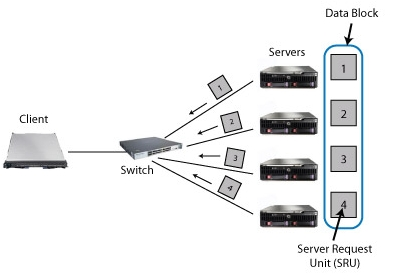

Notes of various stuff.

# TCP INCAST
"TCP Incast" refers to a network congestion issue that can occur in data center networks. It happens when multiple servers or nodes simultaneously request data from a single source, often a storage device, over a network using the Transmission Control Protocol (TCP).

In this scenario, the network can become congested because of the sudden influx of requests. TCP congestion control algorithms, designed to regulate data flow to avoid network congestion and ensure reliable delivery, may not effectively handle this simultaneous burst of requests. As a result, the network may experience performance degradation, increased latency, or even packet loss.

TCP Incast can significantly impact the performance of applications running in data center environments, especially those relying on distributed storage systems or parallel processing. Various techniques, such as buffering, load balancing, and congestion control mechanisms, are employed to mitigate TCP Incast issues and improve network performance and reliability in data center settings.

TCP Incast is a catastrophic TCP throughput collapse that occurs as the number of storage servers sending data to a client increases past the ability of an Ethernet switch to buffer packets. In a clustered file system, for example, a client application requests a data block striped across several storage servers, issuing the next data block request only when all servers have responded with their portion (Figure 1). 

This synchronized request workload can result in packets overfilling the buffers on the client's port on the switch, resulting in many losses. Under severe packet loss, TCP can experience a timeout that lasts a minimum of 200ms, determined by the TCP minimum retransmission timeout (RTOmin).

Solutions:
* Larger switch buffers can delay the onset of Incast (doubling the buffer size doubles the number of servers that can be contacted). But increased switch buffering comes at a substantial cost
* Ethernet flow control is effective when the machines are on a single switch, but is dangerous across inter-switch trunks because of head-of-line blocking.
* Reducing TCP's minimum RTO allows nodes to maintain high throughput with several times as many nodes. We find that providing microsecond resolution TCP retransmissions can achieve full throughput for many servers

# TCP, Nagle, RTT, etc..  
Some implementations of TCP use the **Nagle** algorothm to improve efficiency. the algorithm waits until the sender buffer size is full before actually transmitting a packet. This can cause non deterministic delays when small data should be sent
as it can linger in the queue until other data is ready to be sent for the same flow or until specific timer expires.

The **TCP window size** and the **round-trip time (RTT)** limit the **throughput**: **no more than one window size per RTT can be transported.**
Essentially, with a large RTT (latency) you need a larger window for the same throughput than with a smaller RTT. If you can't increase the window you can't utilize the full bandwidth. This is why the **bandwidth-delay** product is important to model throughput scenarios in network planning.

If at some time, somewhere on the way, a port's capacity is reached and packets can't be forwarded right away. They need to get queued. They spend more time on the way, so ACKs begin to arrive late. The **RTT measured** by the sender goes up.
In response to filling buffers -> growing RTT the **window is reduced again**. Sending slows, queues empty, RTT goes down again. In response, the window is allow to grow, starting the cycle over.

# TCP Packet loss detetction and Fast Recovery

When a TCP **sender** detects packet loss, instead of waiting for a timeout to retransmit the lost packet (as in TCP Reno and TCP Tahoe), **TCP Fast Recovery** allows the sender to immediately retransmit the missing packet based on duplicate acknowledgments received from the receiver.

Here's how TCP Fast Recovery works:

* Detection of Packet Loss: When the sender detects packet loss (indicated by the absence of acknowledgments for a particular packet within a certain timeout period), it would wait until RTO is expired  before retransmitting the segment. RTO expiring will activate Fast retransmission if available.
* Sending Duplicate ACKs: The **receiver** sends duplicate acknowledgments (ACKs) for the out-of-order packets it receives. These duplicate ACKs inform the sender that the **receiver** has received packets beyond the missing one.
** Fast Retransmit**: Upon receiving three duplicate ACKs (indicating that the receiver has received the subsequent packets but not the missing one), the sender assumes that the missing packet has been lost. It then retransmits the missing packet without waiting for a retransmission timeout.

**Fast Recovery**: After the fast retransmit, instead of reducing the congestion window size as it would during a timeout event, TCP Fast Recovery reduces the congestion window by half and enters the Fast Recovery state. In this state, the sender continues to send new packets (referred to as "recovery packets") while waiting for an acknowledgment for the retransmitted packet.
Exiting Fast Recovery: When the sender receives an acknowledgment for the retransmitted packet or a new segment, it exits the Fast Recovery state and returns to the normal congestion avoidance phase of TCP's congestion control algorithm.